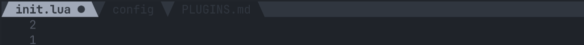

# mantel.nvim

A dead-simple, lightweight, customizable and _cozy_ tabline/bufferline for Neovim

## Table of Contents

- [Table of Contents](#table-of-contents)
- [Motivation](#motivation)
- [Installation](#installation)
- [Usage](#usage)
- [Concepts](#concepts)
- [License](#license)
- More
  - [References](./docs/References.md)
  - [Configuration](./docs/Configuration.md)
  - [Commands](./docs/Commands.md)
  - [Recipes](./docs/Recipes.md)

## Motivation

Neovim’s built-in tabline works well... but can certainly look better. Many plugins offer powerful bufferline features, but often introduce heavy abstractions or complex configuration.

`mantel.nvim` aims to provide a **simple, predictable, and hackable tabline layer** that stays close to Neovim’s native behavior while still allowing deep customization (if and when desired).

The idea is simple: give users a **clean way to render buffer and tab indicators** without too much hassle.

If you want to know _why_, when there are already so many bufferline plugins, check out the [Comparison](#comparison) section at the end of this README.

## Preview

Default configuration:


Custom configuration example:



## Features

- **No dependencies**
- Works with **buffers and tabs**
- Flexible decorator system
- Configurable highlight groups
- Colorscheme-friendly defaults
- Simple, predictable configuration
- Minimal runtime overhead

### Next on the roadmap

- [x] Diagnostic indicators
- [x] Decorator custom HL improvements
- [ ] LSP status indicators

## Installation

> `mantel.nvim` requires Neovim **0.10** or higher

### Using vim-plug

```vim
Plug 'leo-alvarenga/mantel.nvim'
```

### Using lazy.nvim

```lua
{
  "leo-alvarenga/mantel.nvim",
  opts = {},
}
```

## Usage

Setup is straightforward:

```lua
require("mantel-nvim").setup({})
```

No configuration is required.

For more details on configuration options, see the [Configuration](./docs/Configuration.md) page.

## Concepts

`mantel.nvim` organizes the tabline around two main components.

### Buffers

Buffers represent open files.

Each buffer entry supports:

- decorators
- custom names
- highlight groups
- minimum width

### Tabs

Tabs represent Neovim tabpages.

They can be enabled or disabled independently from buffers.

## Comparison

`mantel.nvim` focuses on **simplicity and flexibility**, not feature overload.

| Plugin          | Philosophy                                           |
| --------------- | ---------------------------------------------------- |
| bufferline.nvim | Feature-rich UI with many integrations               |
| barbar.nvim     | Full tab-like buffer management                      |
| `mantel.nvim`   | Minimal, customizable tabline close to native Neovim |

### Key differences

**mantel.nvim**

- simple architecture
- minimal logic
- very customizable rendering
- predictable behavior

**bufferline.nvim**

- advanced UI
- animations, groups

**barbar.nvim**

- full tab-like buffer workflow
- navigation commands

If you want a **powerful UI**, use those plugins.

If you want a **simple tabline you can fully control**, `mantel.nvim` may fit better.

## License

This project is licensed under the GPLv3 License. See the [LICENSE](LICENSE) file for details.
