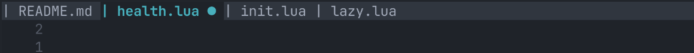

# mantel.nvim

A dead-simple, lightweight, customizable and _cozy_ tabline/bufferline for Neovim

## Motivation

Neovim’s built-in tabline works well... but can certainly look better. Many plugins offer powerful bufferline features, but often introduce heavy abstractions or complex configuration.

`mantel.nvim` aims to provide a **simple, predictable, and hackable tabline layer** that stays close to Neovim’s native behavior while still allowing deep customization (if and when desired).

The idea is simple: give users a **clean way to render buffer and tab indicators** without too much hassle.

If you want to know _why_, when there are already so many bufferline plugins, check out the [Comparison](#comparison) section at the end of this README.

## Preview

Default configuration:



Custom configuration example:


# Features

- **No dependencies**
- Works with **buffers and tabs**
- Flexible decorator system
- Configurable highlight groups
- Colorscheme-friendly defaults
- Simple, predictable configuration
- Minimal runtime overhead

## Next on the roadmap

- [x] Diagnostic indicators
- [x] Decorator custom HL improvements
- [ ] LSP status indicators

# Installation

> `mantel.nvim` requires Neovim **0.10** or higher

## Using vim-plug

```vim
Plug 'leo-alvarenga/mantel.nvim'
```

## Using lazy.nvim

```lua
{
  "leo-alvarenga/mantel.nvim",
  opts = {},
}
```

# Usage

Setup is straightforward:

```lua
require("mantel-nvim").setup({})
```

No configuration is required.

# Concepts

`mantel.nvim` organizes the tabline around two main components.

## Buffers

Buffers represent open files.

Each buffer entry supports:

- decorators
- custom names
- highlight groups
- minimum width

## Tabs

Tabs represent Neovim tabpages.

They can be enabled or disabled independently from buffers.

# Commands

`mantel.nvim` exposes a few user commands for interacting with the tabline.

### `:MantelMoveBufLeft`

Moves the current buffer **one position to the left** in the tabline.

This command only works when `mode = "enhanced"` is enabled.

Example mapping:

```lua
vim.keymap.set("n", "<leader>bh", "<cmd>MantelMoveBufLeft<CR>")
```

### `:MantelMoveBufRight`

Moves the current buffer **one position to the right** in the tabline.

This command also requires `mode = "enhanced"`.

Example mapping:

```lua
vim.keymap.set("n", "<leader>bl", "<cmd>MantelMoveBufRight<CR>")
```

### `:MantelReloadColors`

Reloads the highlight groups used by `mantel.nvim`.

This can be useful when:

- changing colorschemes
- tweaking highlight overrides
- testing colors during development

Example:

```vim
:MantelReloadColors
```

# Default configuration

Everything has a default value, so configuration is optional.

```lua
require("mantel-nvim").setup({
  mode = "classic",

  bufs = {
    decorators = {
      sep = "",
      prefix = "| ",
      suffix = " ",

      modified = {
        order = 1,
        text = " ●",
        position = "suffix",
      },
    },

    min_width = 10,

    hl = {
      fill = "MantelFill",
      inactive = "MantelInactive",
      active = "MantelActive",
      modified = "MantelModified",
      duplicate = "MantelDuplicate",
      separator = "MantelSeparator",
    },

    overwrites = {
      ambiguos = function(buf)
        return vim.fn.fnamemodify(buf.name, ":.")
      end,

      name = function(buf)
        return vim.fn.fnamemodify(buf.name, ":t")
      end,

      no_name = "[No name]",
    },
  },

  tabs = {
    decorators = {
      sep = "",
      prefix = "| ",
      suffix = " ",

      modified = {
        order = 1,
        text = " ●",
        position = "suffix",
      },
    },

    enabled = "auto",
    min_width = 5,

    hl = {
      fill = "MantelFill",
      inactive = "MantelInactive",
      active = "MantelActive",
      modified = "MantelModified",
      duplicate = "MantelDuplicate",
      separator = "MantelSeparator",
    },
  },

  highlight_overwrites = function()
    -- derived from colorscheme-agnostic defaults
  end,
})
```

# Customization Examples

## Change buffer prefix

```lua
require("mantel-nvim").setup({
  bufs = {
    decorators = {
      prefix = "▎ ",
    },
  },
})
```

## Disable modified indicator

```lua
require("mantel-nvim").setup({
  bufs = {
    decorators = {
      modified = {
        text = ""
      },
    },
  },
})
```

## Always show tabs

```lua
require("mantel-nvim").setup({
  tabs = {
    enabled = "always",
  },
})
```

## Custom separator

```lua
require("mantel-nvim").setup({
  bufs = {
    decorators = {
      prefix = " ",
      suffix = " ",
      sep = ">",
    },
  },
})
```


## Custom buffer name

```lua
require("mantel-nvim").setup({
  bufs = {
    overwrites = {
      name = function(buf) -- Use a function to generate the name however you want!
        return vim.fn.fnamemodify(buf.name, ":~:.")
      end,
      no_name = "Empty Buffer", -- Or just a string for static names
    },
  },
})
```

## Custom highlight groups

You can override the highlight definitions used internally...

```lua
require("mantel-nvim").setup({
  highlight_overwrites = function()
    return {
      active = { bold = true },
      inactive = { italic = true },
    }
  end,
})
```

... or use other groups (maybe even your own groups) in the configuration:

````lua
require("mantel-nvim").setup({
  bufs = {
    hl = {
      active = "TabLineSel", -- Neovim's default active tab highlight
      inactive = "MyInactiveHighlight", -- your own custom highlight group!
    },
  },
})


# Options Reference

| Field                  | Type                                          | Description                          | Default                  |
| ---------------------- | --------------------------------------------- | ------------------------------------ | ------------------------ |
| `mode`                 | `"classic" \| "enhanced"`                     | Buffer ordering behavior             | `"classic"`              |
| `bufs`                 | `mantel-nvim.Bufs`                            | Buffer configuration                 | see below                |
| `tabs`                 | `mantel-nvim.Tabs`                            | Tab configuration                    | see below                |
| `highlight_overwrites` | `mantel-nvim.HighlightOverwrites \| function` | Highlight definitions used by Mantel | derived from colorscheme |


## Buffer Options

| Field                          | Type       | Default       |
| ------------------------------ | ---------- | ------------- |
| `decorators.sep`               | `string`   | `""`          |
| `decorators.prefix`            | `string`   | `""`          |
| `decorators.suffix`            | `string`   | `" "`         |
| `decorators.modified.text`     | `string`   | `" ●"`        |
| `decorators.modified.position` | `"suffix"` | `"suffix"`    |
| `min_width`                    | `integer`  | `10`          |
| `overwrites.no_name`           | `string`   | `"[No name]"` |


## Tab Options

| Field       | Type                            | Default  |
| ----------- | ------------------------------- | -------- |
| `enabled`   | `"auto" \| "always" \| "never"` | `"auto"` |
| `min_width` | `integer`                       | `5`      |


# Types

Requiring the `mantel-nvim.types` module exposes types for autocompletion and other goodies:

```lua
require("mantel-nvim.types")
````

```lua
--- @class mantel-nvim.Opts
--- @field mode "classic"|"enhanced"
--- @field bufs mantel-nvim.Bufs
--- @field tabs mantel-nvim.Tabs
--- @field highlight_overwrites mantel-nvim.HighlightOverwrites|fun(): mantel-nvim.HighlightOverwrites
```

# Comparison

`mantel.nvim` focuses on **simplicity and flexibility**, not feature overload.

| Plugin          | Philosophy                                           |
| --------------- | ---------------------------------------------------- |
| bufferline.nvim | Feature-rich UI with many integrations               |
| barbar.nvim     | Full tab-like buffer management                      |
| `mantel.nvim`   | Minimal, customizable tabline close to native Neovim |

### Key differences

**mantel.nvim**

- simple architecture
- minimal logic
- very customizable rendering
- predictable behavior

**bufferline.nvim**

- advanced UI
- animations, groups

**barbar.nvim**

- full tab-like buffer workflow
- navigation commands

If you want a **powerful UI**, use those plugins.

If you want a **simple tabline you can fully control**, `mantel.nvim` may fit better.

## License

This project is licensed under the GPLv3 License. See the [LICENSE](LICENSE) file for details.
