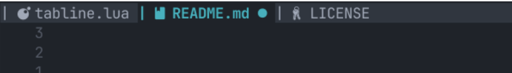
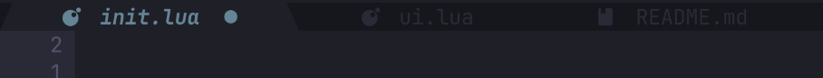
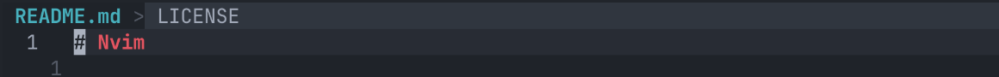
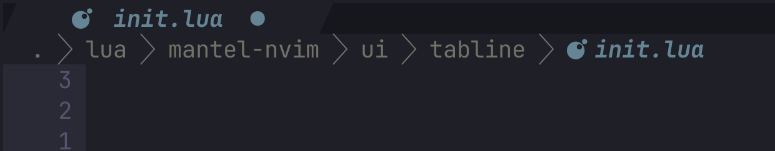

# mantel.nvim

A lightweight, customizable and cozy tabline/bufferline (with breadcrumbs) for Neovim

## Table of Contents

- [Table of Contents](#table-of-contents)
- [Motivation](#motivation)
- [Installation](#installation)
- [Usage](#usage)
- [Concepts](#concepts)
- [License](#license)
- More
  - [References](./docs/References.md)
  - [Configuration](./docs/Configuration.md)
  - [Commands](./docs/Commands.md)
  - [Recipes](./docs/Recipes.md)

## Motivation

Neovim’s built-in tabline works well... but can certainly look better. Many plugins offer powerful bufferline features, but often introduce heavy abstractions or complex configuration.

`mantel.nvim` aims to provide a **simple, predictable, and hackable tabline layer** that stays close to Neovim’s native behavior while still allowing deep customization (if and when desired).

The idea is simple: give users a **clean way to render buffer and tab indicators** without too much hassle.

### Roadmap

- [x] Basic bufferline rendering
- [x] Tabline support
- [x] Decorator system
- [x] Icon support
- [x] Diagnostic indicators
- [x] Configurable highlights
- [x] Document new sleek look!
- [x] Breadcrumbs support!
- [ ] Improve overflow handling <- Currently in progress
  - [ ] Add ellipsis on overflow
  - [ ] Always center on the current buffer
  - [ ] Ensure spacing is done correctly

## Preview

Default configuration (using the `default` style preset):



Or without icons:


With the `slanted` style preset:


With the `sloped` style preset:



With a custom separator:



With the Breadcrumbs enable:


## Features

- **No dependencies**
- Works with **buffers and tabs**
- Flexible decorator system
- Configurable highlight groups
- Colorscheme-friendly defaults
- Simple, predictable configuration
- Icon support (optional)
- Diagnostic indicators (optional)
- Minimal runtime overhead

## Installation

> `mantel.nvim` requires Neovim **0.10** or higher

### Using vim-plug

```vim
Plug 'leo-alvarenga/mantel.nvim'
```

### Using lazy.nvim

```lua
{
  "leo-alvarenga/mantel.nvim",
  opts = {},
}
```

## Usage

Setup is straightforward:

```lua
require("mantel-nvim").setup({})
```

No configuration is required.

For more details, read the Concepts section below and check out the [Configuration](./docs/Configuration.md) and [Commands](./docs/Commands.md) documentation.

## Concepts

> Read the section below to understand the core concepts behind `mantel.nvim` and how to use them to customize your experience and only **after** that, check out the [Configuration](./docs/Configuration.md) documentation for concrete examples of how to apply these concepts in practice.

`mantel.nvim` offers two main components for displaying information: the **bufferline** (or tabline) and the **breadcrumbs** (or winbar). These components can be enabled independently, allowing you to choose which information you want to see and how you want to see it.

Both components are designed to be flexible and customizable (each in their own way), while still providing sensible defaults that work well out of the box.

> `mantel.nvim` provides a powerful buffer reordering system that allows you to easily move buffers around in the bufferline, either with commands or keybindings; To enable it, change `opts.mode` to `enhanced`

A few important concepts to understand when configuring `mantel.nvim`:

- highlights
  - named highlight groups that define the colors and styles to be used when rendering the bufferline and breadcrumbs. You can create your own custom highlight groups or use existing ones from your colorscheme, and then reference them in your `mantel.nvim` configuration
  - run `:h highlight-groups` in Neovim to see all available highlight groups (natively) and their names
- highlight overwrites
  - a feature that allows you to specify colors to be used in `mantel-nvim`'s own highlights
- **decorators**
  - small pieces of text (e.g., icons, diagnostic indicators) that can be added to buffer or tab entries in the bufferline to provide additional information (e.g. git status) at a glance OR to add visual flair (e.g. a custom icon for certain file types)
  - these can be static (a plain string) or dynamic (a function that returns a string based on the buffer to be rendered)
- **parts**
  - sections of the breadcrumbs that can be configured to show different types of information (e.g., file path, LSP symbols, etc). Each part can be customized in terms of what it shows and how it looks
  - each part is an object (table) that contains the text to be rendered, its character count (len) and whether it should have a special highlight or not (focused)
  - these can be static (a list with all parts to show) or dynamic (a function that returns a list of parts based on the buffer to be rendered)
    - technically, each part can also be dynamic in the sense that it can decide what to show based on the buffer

So, in summary, to drastically customize your `mantel.nvim` experience, you:

1. Configure new highlight groups, declaring custom colors for the text and background to be used when rendering (optional, since there are good defaults)
   a. AND/OR you pass highlight names to the decorators and parts you use in the bufferline and breadcrumbs configuration, so that they can be applied when rendering instead of the default ones
2. Configure custom decorators for the bufferline, which can be used to add icons, diagnostic indicators, or any other custom text you want to show for each buffer or tab
3. Configure parts for the breadcrumbs, which can be used to show different sections of information (e.g., file path, LSP symbols, etc)

### Bufferline (Tabline)

> `tabline` is the name of the Neovim option that controls the display of tabs (or arbitrary text) at the top of your view. In `mantel.nvim`, we use this term to refer to the entire line that can show both buffers and tabs.

In `mantel.nvim`, the bufferline is designed to show both buffers and tabs in a cohesive way, while balacing flexibility and simplicity.


#### Buffers

Buffers represent open files.

Each buffer entry supports:

- decorators
- custom names
- highlight groups
- minimum width

#### Tabs

Tabs represent Neovim tabpages.

They can be enabled or disabled independently from buffers.

There are three modes for tabs, configured via the `opts.tabs.enabled` option:

- `auto`: (Default) tabs are shown when there are more than 1 tabpages open, otherwise they are hidden
- `always` or `true`: tabs are always shown, even if there is only 1 tabpage open
- `never` or `false`: tabs are never shown, even if there are multiple tabpages open

### Breadcrumbs (Winbar)

> `winbar` is a Neovim option that allows you to display information at the top of each window (windows are the **splits**, FYI). In `mantel.nvim`, we use this term to refer to the line that can show breadcrumbs, which typically include the file path (by default).

**Breadcrumbs** are a separate component that can be enabled to show the current file path and context in the `winbar`.


Different from the bufferline, breadcrumbs are designed to show contextual information about the current file and its location within the project. Here, there are no decorators, instead **parts** can be used to define different sections of the breadcrumbs (e.g., file path, LSP symbols, etc).

When configuring breadcrumbs, you tell `mantel.nvim` what parts you want to show and in which order, and it will handle the rendering for you.

Each part can be dynamic, meaning it can decide what to show based on the current buffer, and so do the parts list _itself_ (i.e., you can have a function that returns different lists of parts based on the buffer, each part can also be dynamic and decide what to show based on the buffer).

Also, breadcrumbs can be **toggled**, meaning you can show or hide them on demand (e.g., with a keybinding). This is useful if you want to quickly check the file path and then hide it again to save space.

There are two breadcrumbs behavior modes, configured via the `opts.breadcrumbs.behavior` option:

- `auto-inclusive`: (Default) breadcrumbs are shown in all windows, automatically. You can toggle individual windows on or off, but by default they are all on
- `manual`: breadcrumbs are hidden by default, and you have to toggle them on for each window you want to see them

## License

This project is licensed under the GPLv3 License. See the [LICENSE](LICENSE) file for details.
